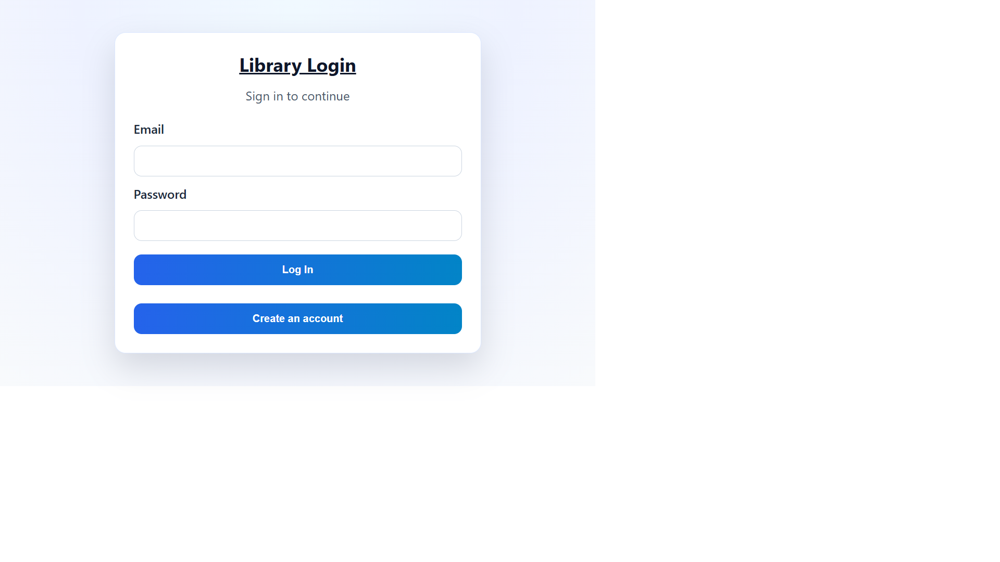
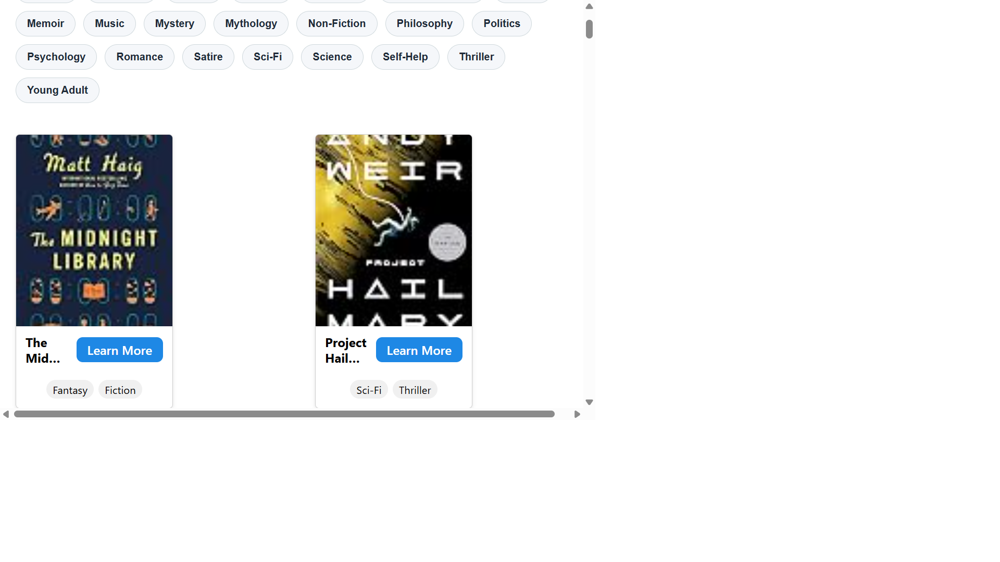
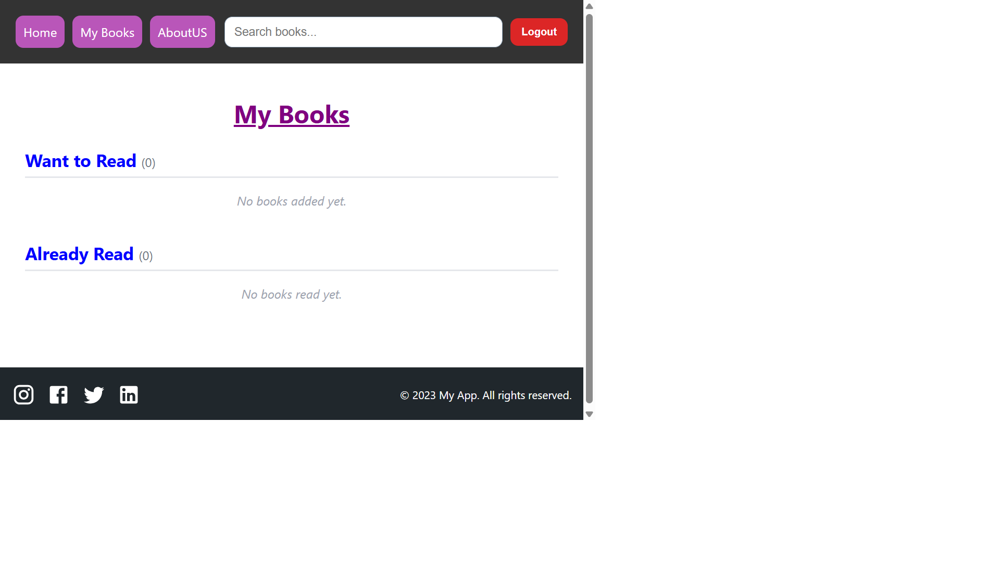
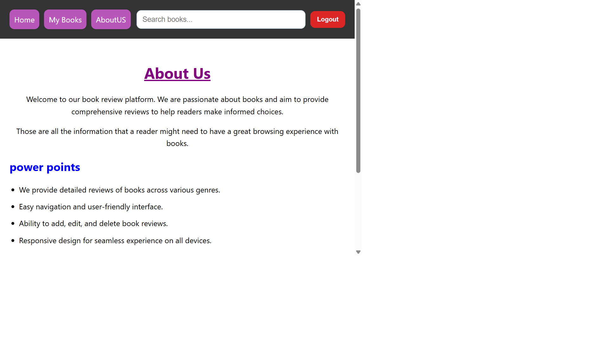
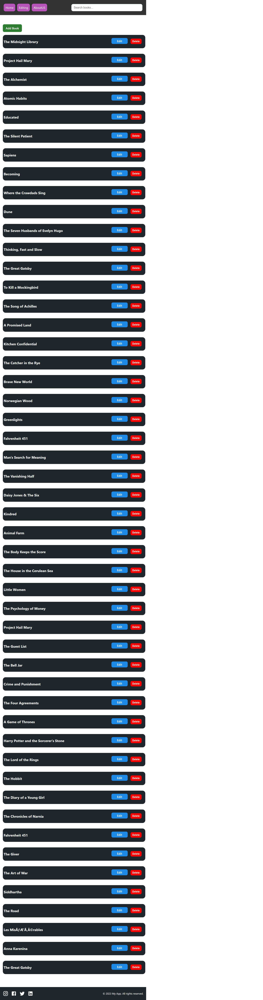

# CSCI426 – Library App (Phase 1)
**Student:** Saleh Moussa &nbsp;|&nbsp; **ID:** 42430198

## Project Description
A full-stack library management web application built with React and Node.js/Express backed by a MySQL database.

## Features
### All Users
- Browse and search the books catalog by name, publisher, or genre
- View detailed book information with Goodreads star rating
- Personal reading list (**My Books** page) — mark books as *Want to Read* or *Already Read* with a personal rating (0 – 5)

### Admin Only
- Add, edit, and delete books via the **Editing** page
- Editing link is hidden from regular users and the route is protected

### Authentication
- Sign up / Log in with email and password
- Session-based authentication (stored in `sessionStorage`)
- Role-based access control (`user` / `admin`)

## Tech Stack
| Layer | Technology |
|---|---|
| Frontend | React 18, React Router, Axios, MUI |
| Backend | Node.js, Express 5 |
| Database | MySQL (mysql2) |

## Project Structure
```
├── bach_end/          # Express API server
│   ├── server.js      # All routes (books, auth, user reading list)
│   └── auth-utils.mjs # Email validation helpers
└── front_end/         # React application
    └── src/
        ├── pages/
        │   ├── Home.jsx
        │   ├── BookDetails.jsx   # Want-to-Read / Already-Read buttons
        │   ├── MyBooks.jsx       # User reading list table
        │   ├── editing.jsx       # Admin book management
        │   └── Login.jsx
        └── components/
            └── NavBar.jsx        # Role-aware navigation
```

## Database Tables
| Table | Purpose |
|---|---|
| `books` | Book catalog |
| `users` | Accounts with `email`, `password`, `role` |
| `user_books` | Per-user reading list with `status` and `user_rating` |

## Setup Instructions

### Backend
```bash
cd bach_end
npm install
node server.js
# API runs on http://localhost:5000
```

### Frontend
```bash
cd front_end
npm install
npm start
# App runs on http://localhost:3000
```

> Make sure MySQL is running and a database named `waww` exists before starting the backend. The server auto-creates the required tables on startup.

## Screenshots

### Login Page


### Home Page


### Book Details Page


### My Books Page


### About Page



## Git Version Control And Commit History
This project uses Git.

Useful commands:

```bash
git status
git log --oneline --decorate --graph -n 20
```

Commit workflow:

```bash
git add .
git commit -m "Your commit message"
git push origin master
```

## Frontend Hosting (GitHub Pages)
The project is configured for GitHub Pages deployment.

1. In `package.json`, set this field to your real repository path:

```json
"homepage": "https://<your-github-username>.github.io/<your-repo-name>"
```

2. Ensure your project has a GitHub remote and push your code:

```bash
git remote add origin https://github.com/<your-github-username>/<your-repo-name>.git
git push -u origin master
```

3. Deploy:

```bash
npm run deploy
```

4. In GitHub repository settings:
- Open `Settings` -> `Pages`.
- Set source to `gh-pages` branch (if not auto-selected).

## Screenshots Of The UI

### Home Page


### Editing Page

